<!-- ═══════════════════════════════════════════════════════════════════════════ -->
<!--          NISHANT UPADHYAY — GitHub Profile README (PREMIUM v3)            -->
<!-- ═══════════════════════════════════════════════════════════════════════════ -->

<!-- ▓▓▓ HEADER BANNER — Self-hosted SVG, always loads ▓▓▓ -->


<!-- ▓▓▓ VISITOR + STATUS BADGES ▓▓▓ -->
<div align="center">
<br/>


&nbsp;

&nbsp;

&nbsp;


</div>

<!-- ▓▓▓ TYPING ANIMATION ▓▓▓ -->
<div align="center">
<br/>

[](https://github.com/Nishant567)

</div>

<!-- ▓▓▓ CONTACT BADGES ▓▓▓ -->
<div align="center">
<br/>

[](https://linkedin.com/in/nishantupadhyay25)
&nbsp;
[](mailto:nishantupadhya567@gmail.com)
&nbsp;
[](tel:+918510003531)

<br/><br/>

</div>

---

## 🧑‍💻 About Me

```csharp
public class NishantUpadhyay : DotNetDeveloper
{
    public string Name       => "Nishant Upadhyay";
    public string Role       => "ASP.NET Core 8 Developer";
    public string Company    => "Tenet Health Edutech Pvt. Ltd., Noida";
    public int    Experience => 3; // years
    public string Location   => "Greater Noida, India";

    public string[] CurrentlyBuilding => new[] {
        "AI Learning Platform — 8 Microservices on Azure",
        "5,000+ daily requests with Redis caching"
    };

    public string BiggestWin =>
        "SQL query: 5s → 2s (60% faster) via indexing + execution plan — zero infra cost";

    public string[] Certifications => new[] {
        "Microsoft Azure Fundamentals (AZ-900)",
        "ASP.NET Core 8 Web Development",
        "SQL Server 2022"
    };

    public string Availability => "Open to .NET Roles — Remote / Hybrid / Onsite | Notice: 30 Days";
}
```

---

## 🛠️ Tech Stack

### 🔷 Languages


### ⚙️ Frameworks & Libraries


### 🧠 Architecture & Concepts


### 🗄️ Databases


### ☁️ Cloud & DevOps


### 🔧 Tools


---

## 📊 GitHub Stats

<div align="center">


&nbsp;&nbsp;


</div>

<div align="center">


</div>

<div align="center">


</div>

---

## 🚀 Professional Projects

> 💼 *Production systems built at Tenet Health Edutech Pvt. Ltd.*

<table>
<tr>
<td width="50%" valign="top">

### 🎓 Cliniminds LMS
**ASP.NET Core 8 · EF Core · SQL Server 2022 · Azure · Identity**

✅ **1,000+ users** — zero-downtime Azure deployments  
✅ Certificate generation — **80% less manual work**  
✅ GST fee module — **₹50 Lakh+** transactions/year  
✅ Dashboard: **8s → 3s** (60% faster)  
✅ Role-based access: Students · Trainers · Admins  
✅ **50+ stored procedures** · 10,000+ daily transactions  

</td>
<td width="50%" valign="top">

### 🤖 Interview Prep Platform
**ASP.NET Core 8 · SQL Server · Azure DevOps · Google Gemini AI**

✅ **10+ REST APIs** for mock tests + real-time scoring  
✅ **500+ users** with live analytics  
✅ Gemini AI feedback in **< 2 seconds** (90% of users)  
✅ Azure DevOps CI/CD — **99.9% uptime**  

</td>
</tr>
<tr>
<td width="50%" valign="top">

### 📚 AI Learning Platform
**ASP.NET Core 8 · Microservices · EF Core 8 · Redis · Azure**

✅ **8 microservices** with DI — 5,000+ daily requests  
✅ **45% faster** responses via Redis + SQL tuning  
✅ Swagger + Postman — **95% endpoint coverage**  

</td>
<td width="50%" valign="top">

### 📈 By The Numbers

| Metric | Value |
|---|---|
| REST APIs in production | **15+** |
| Stored procedures written | **50+** |
| Agile sprints shipped | **12** |
| Features delivered | **25+** |
| Ahead of schedule | **20%** |
| SQL improvement | **5s → 2s** |
| Dashboard improvement | **8s → 3s** |

</td>
</tr>
</table>

---

## 🏅 Certifications

<div align="center">


&nbsp;

&nbsp;


</div>

---

## 🎓 Education

| Degree | Institution | Year |
|---|---|---|
| 🎓 **MCA** — Master of Computer Applications | Lovely Professional University | 2023 – 2025 |
| 🎓 **BCA** — Bachelor of Computer Applications | Radha Govind College of Education | 2018 – 2021 |

---

## 🤝 Let's Connect

<div align="center">

[](https://linkedin.com/in/nishantupadhyay25)
&nbsp;
[](mailto:nishantupadhya567@gmail.com)
&nbsp;
[](tel:+918510003531)

<br/>


&nbsp;


<br/><br/>
<i>💬 Always open to exciting .NET opportunities and backend engineering challenges!</i>
<br/><br/>

</div>

<!-- ▓▓▓ FOOTER BANNER — Self-hosted SVG, always loads ▓▓▓ -->

